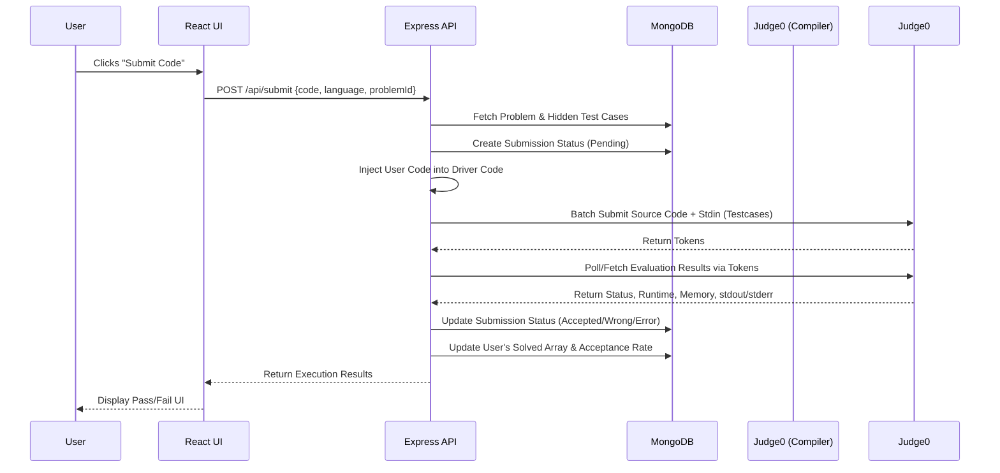
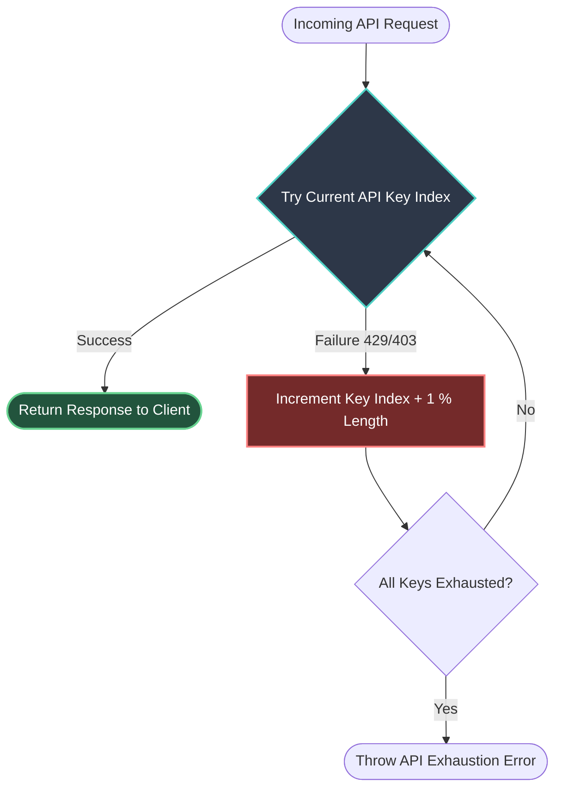
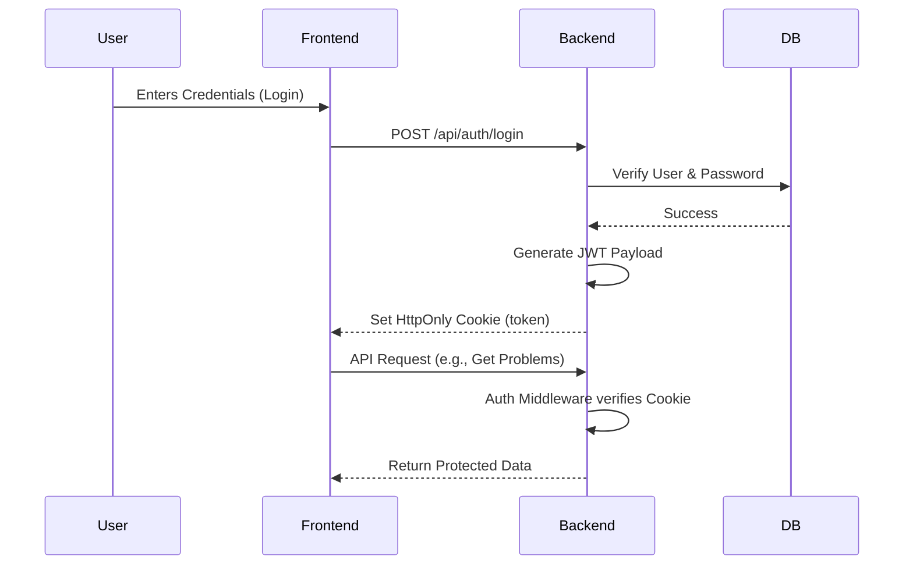
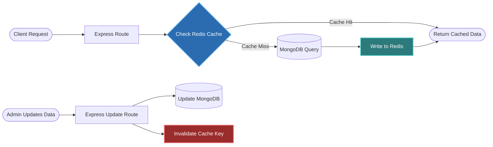
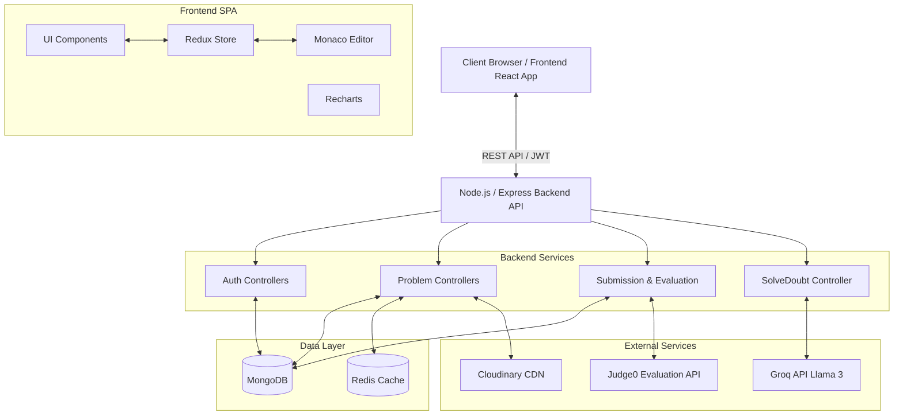
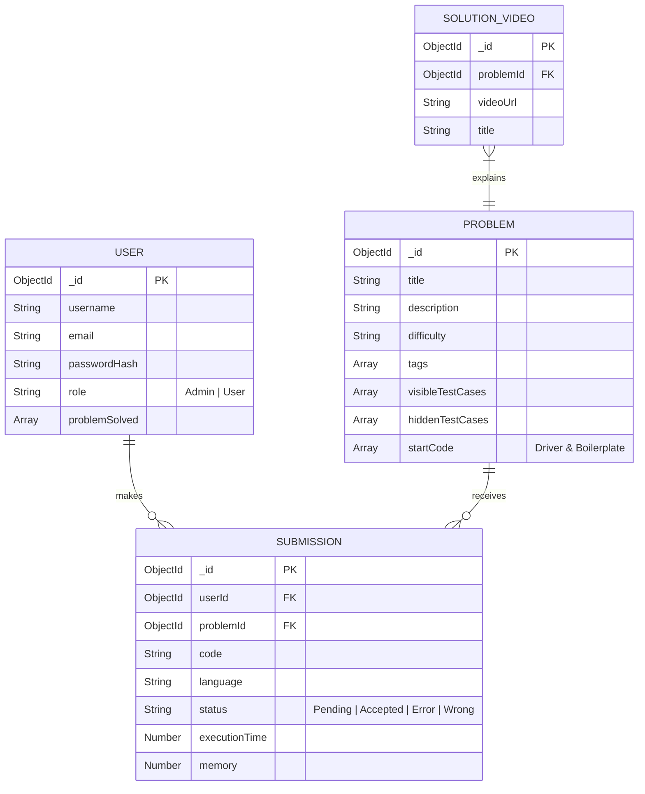

# Code-Here - Interactive Coding Platform

Code-Here is a full-stack interactive coding platform built to provide a seamless environment for developers to solve algorithmic challenges. It features a modern code editor, isolated code execution, and an integrated AI tutor. Built with the MERN stack (MongoDB, Express.js, React, Node.js), it handles user authentication, code evaluation, and performance analytics.

## Core Features and Workflows

### Code Execution Engine
The code evaluation pipeline securely compiles and runs user code against multiple test cases without risking server exposure.

- **Monaco Editor Integration:** Provides a rich, VS-Code-like IDE interface natively in the browser with syntax highlighting, auto-indentation, and multi-language support (C++, Java, JavaScript).
- **Hidden Driver Code Injection:** When a user submits code, the backend automatically wraps it inside a hidden boilerplate template specific to the problem before compilation.
- **Isolated Sandbox Execution:** The injected code is batched with test cases and dispatched to the Judge0 API, which securely evaluates the code inside isolated containers.
- **Granular Execution Metrics:** Returns execution status, runtime in milliseconds, memory consumption, and precise stdout/stderr debugging outputs back to the frontend UI.



### AI-Powered DSA Tutor
The platform includes an integrated AI tutor specifically engineered to help students learn Data Structures and Algorithms without cheating.

- **Groq Integration (Llama 3):** Leverages lightning-fast inference to provide real-time, context-aware coding assistance directly beside the code editor.
- **Context Injection:** Feeds the exact problem description, visible test cases, and the user's currently typed code directly into the AI model's context window.
- **Strict Educational Guardrails:** Configured via system prompts to act strictly as a tutor. It breaks down approaches, offers hints, and analyzes time/space complexity rather than writing the solution outright.
- **Fault-Tolerant Key Rotation:** Features a robust array-based API key rotation mechanism. If the active API key hits a rate limit (429) or fails, the backend seamlessly swaps to the next key and retries without dropping the user's request.



### Authentication and State Management
Security and smooth UI interactions are handled seamlessly across the client and server.

- **Global State Control (Redux Toolkit):** Efficiently manages UI themes, active panel sizes, authenticated user state, and problem history without prop-drilling.
- **Secure JWT Implementation:** Issues JSON Web Tokens that are stored securely in HTTP-only cookies, fully mitigating Cross-Site Scripting (XSS) vulnerabilities.
- **Role-Based Access Control:** Differentiates standard users from Administrators, protecting the Admin Dashboard where problem sets and test cases are managed.
- **Password Encryption:** Employs bcrypt for robust, one-way password hashing before persisting user credentials to the database.



## System Architecture

The application is separated into a frontend Single Page Application (React) and a RESTful backend (Express). 

### Data Flow & Caching Strategy
Data is primarily stored in MongoDB. However, to ensure high performance under load, frequently accessed endpoints are cached via Upstash Redis. 

- **Read-Through Cache:** When a user requests the problem list, the backend checks Redis first. If a cache miss occurs, it queries MongoDB, caches the result in Redis, and returns it to the client.
- **Cache Invalidation:** When an Administrator uploads a new problem or edits an existing one, the Redis cache is aggressively invalidated so all clients receive the fresh data immediately.



### Component Interaction Graph


### Database Entity Relationship
The database schema connects users with their submissions and the problems they solve.



## Technology Stack

**Frontend**
- React 19 (Vite)
- Redux Toolkit
- Tailwind CSS, DaisyUI, Radix UI
- @monaco-editor/react, Recharts

**Backend**
- Node.js, Express.js
- MongoDB (Mongoose)
- Redis (Upstash)
- bcrypt, jsonwebtoken, cookie-parser

**External APIs**
- Groq AI (Llama 3)
- Judge0
- Cloudinary

## Project Directory Structure

```text
📦 FinalProject
├── backend
│   ├── src
│   │   ├── config        # DB/Redis connections
│   │   ├── controllers   # Business logic
│   │   ├── middleware    # Authentication checks
│   │   ├── models        # Mongoose schemas
│   │   ├── routes        # API endpoints mapping
│   │   └── utils         # Utility functions
│   ├── index.js          # Entry Point
│   └── package.json
│
└── frontend
    ├── src
    │   ├── components    # Reusable UI parts
    │   ├── pages         # Route components
    │   ├── redux         # Slices and Redux config
    │   └── utils         # Axios interceptors, helpers
    ├── index.html
    ├── vite.config.js
    └── package.json
```

## Installation & Setup

### Prerequisites
- Node.js (v18+)
- MongoDB connection string
- Upstash Redis REST URL and Token
- Groq API Key(s)
- Judge0 API Key(s)

### Backend Setup
1. Navigate to the backend directory and install dependencies:
```bash
cd backend
npm install
```
2. Create a `.env` file in the `backend` directory:
```env
PORT=3000
DB_CONNECT_STRING=your_mongodb_connection_string
JWT_KEY=your_jwt_secret
UPSTASH_REDIS_REST_URL=your_upstash_redis_url
UPSTASH_REDIS_REST_TOKEN=your_upstash_redis_token
JUDGE0_KEYS=key1,key2,key3
GROQ_API_KEYS=key1,key2,key3
CLOUDINARY_CLOUD_NAME=your_cloud_name
CLOUDINARY_API_KEY=your_api_key
CLOUDINARY_API_SECRET=your_api_secret
```
3. Run the development server:
```bash
npm run dev
```

### Frontend Setup
1. Navigate to the frontend directory and install dependencies:
```bash
cd frontend
npm install
```
2. Create a `.env` file in the `frontend` directory:
```env
VITE_API_BASE_URL=http://localhost:3000/api
```
3. Start the client:
```bash
npm run dev
```

## License
This project is licensed under the ISC License.
